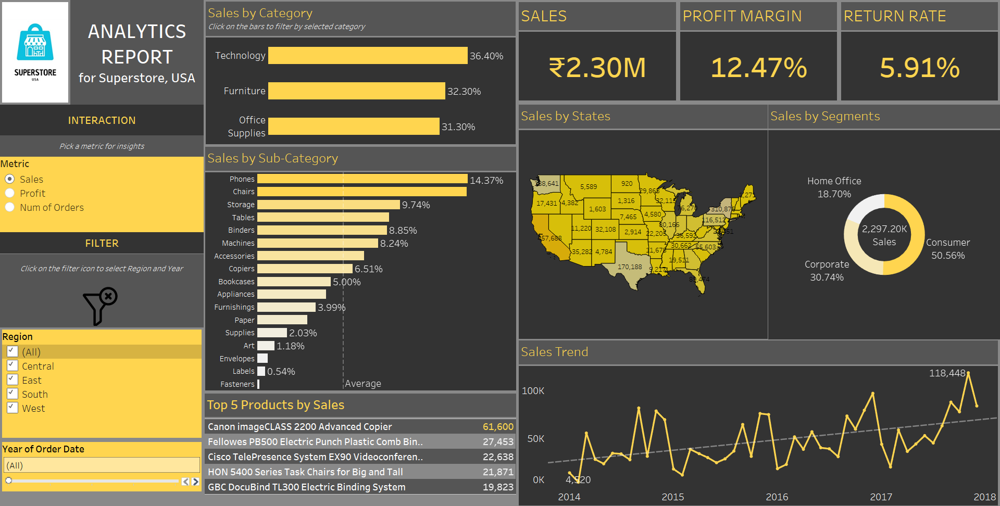

# Superstore Analytics report - Tableau

This project is an interactive **Superstore Analytics report** built using Tableau, designed to analyze and visualize the sales performance of a retail business using the **Sample Superstore dataset**.

## 🚀 Project Overview

The dashboard provides insights into key business metrics such as **Sales, Profit Margin, and Return Rate.** It allows users to interactively explore the data by selecting different metrics, regions, and years.

## 🎯 Key Features

- ✅ **Dynamic KPI Cards** — Display Sales, Profit Margin, and Return Rate with customized number formatting.
- ✅ **Metric Parameter Selector** — Switch between **Sales, Profit, and Number of Orders (# Orders)** dynamically across all charts.
- ✅ **Interactive Filter Panel** — Includes **Region** and **Year** filters with a **Show/Hide Toggle Button** for a cleaner user experience.
- ✅ **Top 5 Products Table** — Automatically updates based on the selected metric using **Rank functions**.
- ✅ **Filter Actions** — Clicking on the Category chart dynamically filters all other charts and KPI cards.
- ✅ **Clean and Consistent UI** — Custom color palettes, background themes, and proper alignment for a professional look.

## 📊 Visualizations Included

- 📈 Sales Trend Line Chart (with average and trend lines)
- 🗺️ Sales by State Map (colored based on metric)
- 🏆 Top 5 Products Table
- 📦 Sales by Category (with filter actions)
- 🪑 Sales by Sub-Category
- 🎯 Sales by Segment (Donut Chart)

## 🧠 Metrics Calculated

- **Sales:** Total revenue generated from orders.
- **Profit Margin:** `(Total Profit / Total Sales) * 100`
- **Return Rate:** `(Number of Returned Orders / Total Orders) * 100`

## 🔗 Dataset

- **Sample Superstore Dataset** (default dataset provided by Tableau)

## 🛠️ Tools Used

- Tableau Desktop

## 📥 Installation / Usage

1. Download or clone this repository.
2. Open the **`.twbx` Tableau workbook** file using **Tableau Desktop.**
3. Ensure the Sample Superstore dataset is correctly connected.
4. Explore the dashboard and interact with filters and metrics.

## 📸 Dashboard

  

## 📜 License

This project is for educational and portfolio purposes only.

---

## ✨ Created By

**Asharani M G**  
*Data Enthusiast | Aspiring Data Analyst*
🔗 [GitHub Profile](https://github.com/ASHARANI-MG)  
📧 ashaa12gowda@gmail.com  
💼 [LinkedIn](https://www.linkedin.com/in/asharani-m-g-a64569229/)

