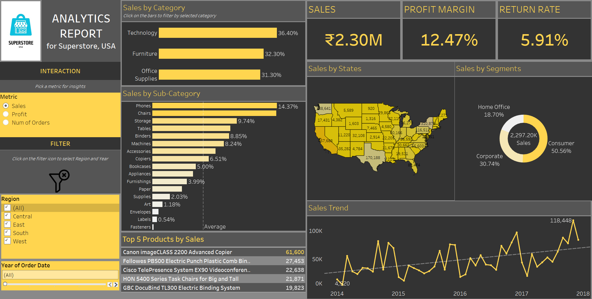

# Super Store Analysis

## 🎯 Objective of the Project
The objective is to analyze the sales and operational data of the Super Store and provide **actionable, data-driven recommendations** to improve business performance.

---

## 📸 Dashboard Snapshot
  
    

---

## 🔍 Key Insights

### ⭐ Overall Performance:
- **Sales:** ₹2.30 Million
- **Profit Margin:** 12.47%
- **Return Rate:** 5.91%

---

### 📦 Category Performance:
- **Highest Profit Margin:** Data Analytics (50.79%)
- **Highest Sales Volume:** Office Supplies
- **Lowest Profit Margin:** Furniture

---

### 🪑 Sub-Category Performance:
- **Highest Profit Margins:** Copiers and Accessories
- **Lowest Profit Margins:** Paper and Binders

---

### 🗺️ State/Segment Performance:
- **Top Segment:** Home Office
- **Lowest Performing Segment:** Corporate

---

### 📈 Profit Trend (2014 - 2018):
- Overall **upward trend** in profit
- Notable **dip in 2015**, followed by steady growth

---

### 🏆 Top 5 Products by Profit:
- **Most Profitable:** Canon imageCLASS 2200 Advanced Copier

---

### 📌 Additional Insights:
- **Region Performance:**  
→ The **"West" region** shows strong performance (as seen in the map visualization).
  
- **Time Analysis:**  
→ Users can filter by **Year** to analyze trends over different time periods.

---

## 🛠️ Tools Used
- Tableau Desktop  

---

## ✨ Created By
**Asharani M G**  
